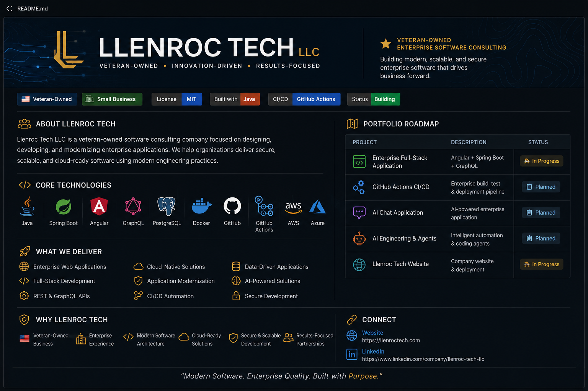

  

# Llenroc Tech LLC

### Veteran-Owned Enterprise Software Consulting

Building modern, scalable, and secure enterprise software with Java, Spring Boot, Angular, GraphQL, Cloud, and AI.

# Llenroc Tech LLC

### Veteran-Owned Enterprise Software Consulting

Building modern, scalable, and secure enterprise software with Java, Spring Boot, Angular, GraphQL, Cloud, and AI.

---

## About Llenroc Tech

Llenroc Tech LLC is a veteran-owned software consulting company focused on designing, developing, and modernizing enterprise applications. We help organizations deliver secure, scalable, and cloud-ready software using modern engineering practices.

---

## Core Technologies

&nbsp;
&nbsp;
&nbsp;
&nbsp;
&nbsp;
&nbsp;
&nbsp;
&nbsp;
&nbsp;
&nbsp;

---

# Current Focus

- Enterprise Full-Stack Development
- Angular + Spring Boot + GraphQL
- Cloud-Native Applications
- GitHub Actions CI/CD
- AI Engineering
- Application Modernization

---

# Portfolio Roadmap

| Project | Description | Status |
|----------|-------------|:------:|
| Enterprise Full-Stack Application | Angular + Spring Boot + GraphQL | 🚧 In Progress |
| GitHub Actions CI/CD | Enterprise build, test & deployment pipeline | 📋 Planned |
| AI Chat Application | AI-powered enterprise application | 📋 Planned |
| AI Engineering & Agents | Intelligent automation & coding agents | 📋 Planned |
| Llenroc Tech Website | Company website & deployment | 🚧 In Progress |

---

# What We Deliver

- Enterprise Web Applications
- Full-Stack Development
- REST APIs
- GraphQL APIs
- Application Modernization
- Cloud Migration
- CI/CD Automation
- AI-Powered Business Solutions

---

# Why Llenroc Tech

- Veteran-Owned Business
- Enterprise Engineering Experience
- Modern Software Architecture
- Cloud-Ready Solutions
- Secure Development Practices
- Continuous Integration & Deployment

---

# Connect

🌐 **Website**

https://llenroctech.com

💼 **LinkedIn**

https://www.linkedin.com/company/llenroc-tech-llc

---

> **Modern Software. Enterprise Quality. Built with Purpose.**
